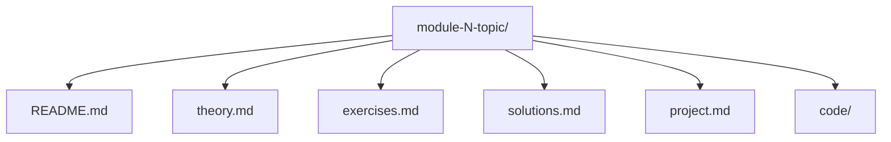

# Module Template

This template is the **single source of truth** for the structure of every course module. Use the copyable skeleton below when creating or refactoring modules.

## Module structure (overview)

Each module directory must contain:

- `README.md` – module name, goal, prerequisites, links to other files
- `theory.md` – concepts, diagrams (Mermaid encouraged), references
- `exercises.md` – numbered exercises (no solutions)
- `solutions.md` – solutions to each exercise
- `project.md` – mini-project objective, requirements, acceptance criteria
- `code/` – minimal runnable Java example and a `README.md` explaining how to build/run

For the exact layout and placeholder content, use **module-skeleton/** (see below).

---

## Content structure and quality

The **content** of each module (what you write in theory.md, exercises.md, solutions.md, project.md and code/) must follow the 10 sections and quality rules in [module-template.md](../module-template.md): Production Context, Technical Deep Dive, Java Implementation, Failure Scenarios, Trade-offs, Exercises, Solutions, Mini Project, Architecture Reflection, and Maturity Checklist. The skeleton files are where that content is written; the content template defines *what* each section must include and *how* to keep quality consistent (e.g. at least 3 exercises, runnable Java, trade-off tables, reflection questions).

---

## How to create a new module

1. **Copy the skeleton**
   - Copy the entire `docs/module-template/module-skeleton/` directory into the correct level folder.
   - Paste it as `module-N-topic-name/` (e.g. `module-5-caching-in-distributed-systems/`).

2. **Rename and update titles**
   - Rename the directory to match your topic (e.g. `module-2-load-balancing`).
   - In every file, replace placeholders: module number, topic name, level name, and any TODO comments.

3. **Fill in content**
   - **theory.md**: core concepts, Mermaid diagrams, references.
   - **exercises.md**: clear exercise descriptions (no solutions).
   - **solutions.md**: step-by-step solutions and code snippets where relevant.
   - **project.md**: objective, requirements, acceptance criteria, optional hints.
   - **code/**: replace the stub with minimal runnable Java (Maven/Gradle or plain Java) and update `code/README.md`.

**Example:** To add a new Level 2 module, copy `module-skeleton/` to `level-2-scaling/module-5-your-topic/`, then rename and edit all files.

---

## File responsibilities

- **README.md**
  - Module name and level.
  - One-paragraph goal.
  - Prerequisites.
  - Links to theory, exercises, solutions, project and code.

- **theory.md**
  - Core concepts and definitions.
  - Diagrams (Mermaid encouraged) for flows/architecture.
  - References and further reading.

- **exercises.md**
  - Numbered exercises, clearly stated.
  - No solutions in this file.

- **solutions.md**
  - Solutions to each exercise.
  - Include reasoning and code snippets when relevant.

- **project.md**
  - Mini-project description.
  - Requirements and acceptance criteria.
  - Optional hints.

- **code/**
  - Minimal, runnable Java examples (plain Java or Maven/Gradle).
  - A `README.md` explaining how to build/run and what the code demonstrates.

---

## Rules

- Every module must have all of the files listed above and at least one runnable example in `code/`.
- Naming: `level-N-theme/module-M-topic/` (e.g. `level-2-scaling/module-1-load-balancing/`).
- Diagrams: prefer Mermaid; no spaces in node IDs; wrap labels with spaces/symbols in quotes.

Use **module-skeleton/** when creating new modules to keep the course consistent and easy to navigate.
