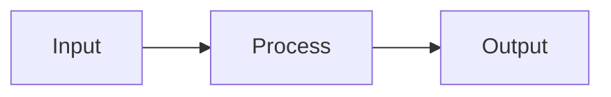

# [Topic Name] – Theory

<!-- Replace [Topic Name] with the module topic. -->

## Concepts

<!-- Core definitions and explanations. Use subsections (### ) as needed. -->

## Diagrams

<!-- Optional: add Mermaid diagrams for flows or architecture. Use node IDs without spaces; quote labels if they contain special characters. -->

## References

<!-- Links to official docs, articles or books. -->
